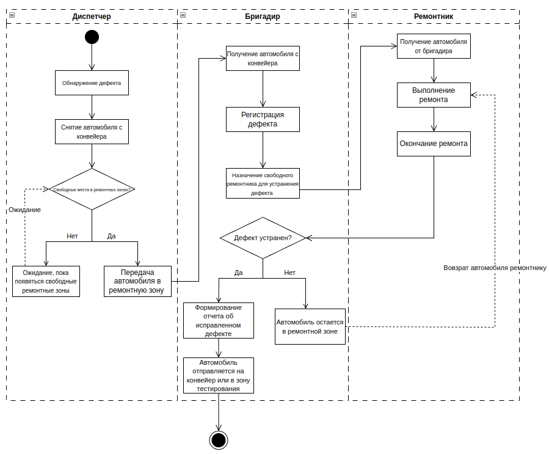
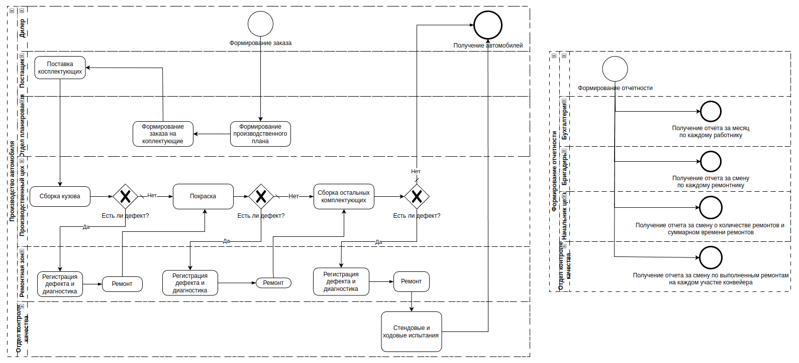

# Анализ требований

## Диаграмма активностей для регистрации и ремонта дефекта

## BPMN-диаграмма для всего бизнес-процесса завода

Есть два основных бизнес-процесса:
1. Производство астомобилей.
2. Составление и предоставление отчетов.
